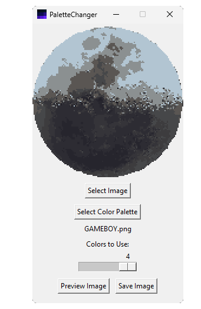

# PaletteChanger

A simple program that changes an images's color palette based on a provided image.

## Features

- Select an image file (various formats supported).
- Input any image as the color palette (auto limits to 256 colors).
- Adjust the number of colors to use from the inputted color palette.
- Colors are replaced based on Euclidean Distance.

## Notes

Works best with actual color palettes as opposed to random images.
