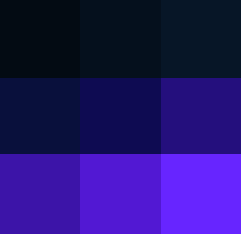
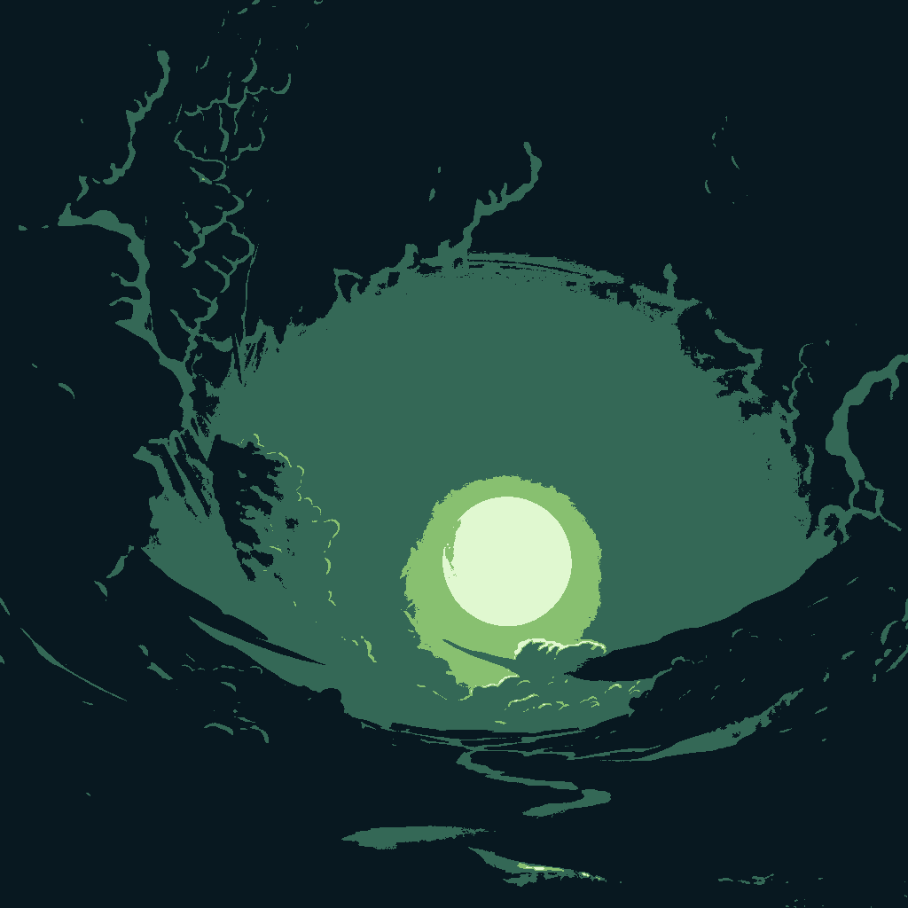

<h1 align="center">
  <br/>
  PaletteChanger
</h1>

<p align="center">
  
  
  
  
</p>

<div align="center">
A browser-based tool for swapping an image's colors to a new palette. Runs client-side with no external dependencies, supporting built-in and custom palettes, automatic and manual color mapping, and exact or smooth output.
</div>

<br/>

<p align="center">
  
  
  <br/>
  <sub>Original → Recolored</sub>
</p>

---

## Quick Start

### 1. GitHub Pages (Online)

Use the hosted version directly in your browser [here](https://meangrinch.github.io/PaletteChanger/).

### 2. Standalone (Offline)

Download `PaletteChanger.html` from [Releases](https://github.com/meangrinch/PaletteChanger/releases) or the repository root and open it in any browser.

### 3. From Source

```bash
git clone https://github.com/meangrinch/PaletteChanger.git
cd PaletteChanger
python scripts/build.py
```

---

## Features

- **Palettes**: Pick from 61 built-in palettes (Game Boy, NES, PICO-8...) or sample one from an image
- **Auto Mapping**: Match the image's colors to the palette by nearest color, or by light-to-dark rank so shading survives any hue change; built-in palettes get one anchor per color and pick the method that suits their size
- **Anchors**: Choose how many of the image's colors (2-256) get their own mapping
- **Manual Mapping**: Click any color in the mapping table to choose its replacement by hand
- **Exact Output**: Swap palettes for pixel art so every pixel matches a palette color
- **Smooth Output**: Shift photos and painted art toward a palette while keeping their shading; output isn't limited to the palette's colors
- **Preview**: Compare edits with a split slider, side-by-side view, hold-to-peek, pixel grid overlay, and up to 3200% zoom, with touch panning and pinch-zoom on phones and tablets
- **Export**: Save as PNG, JPEG, or WebP (native or 2x-16x upscaled), or copy to the clipboard

---

## Support the Project

PaletteChanger is open-source and free. If it saves you time or enhances your workflow, consider supporting its development!

<p align="center">
  <a href="https://ko-fi.com/grinnch" target="_blank">
    
  </a>
</p>

---

## License & Credits

- License: Apache-2.0 (see [LICENSE](LICENSE))
- Author: [grinnch](https://github.com/meangrinch)
